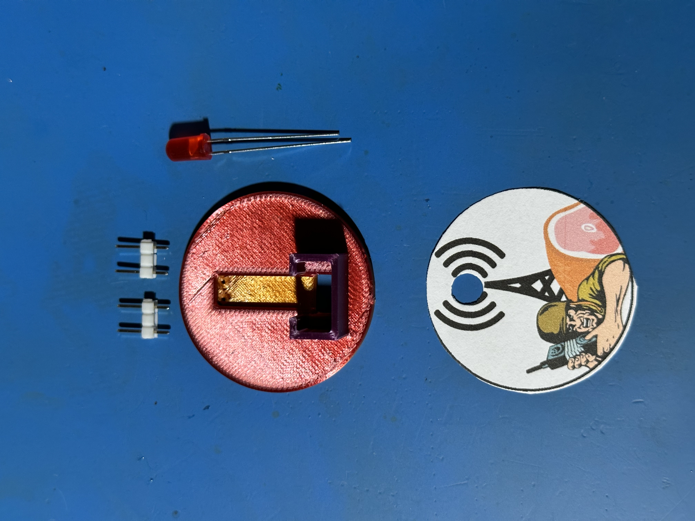
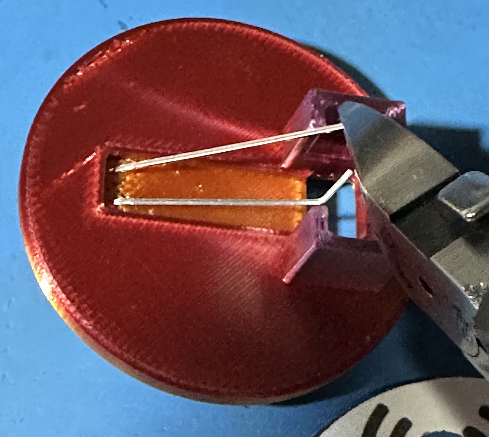
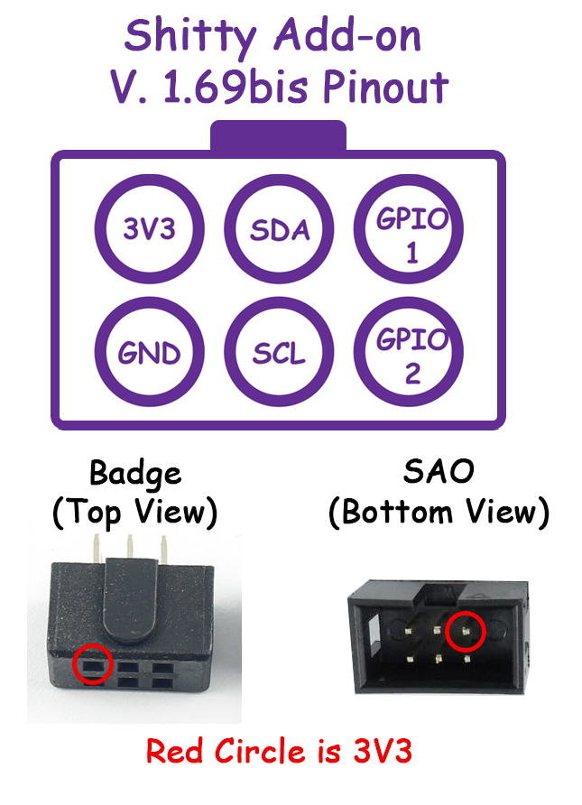

# ShittiestSAO
A 3-D printable SAO that has a single blinking light and uses no PCB. 

Collect all of the parts in the kit, or create your own kit:

## Parts

* 1x Blinking LED
* 1x 2x3 pin 2.54mm headers (You can also use 2x 1x3 headers)
  * The middle pin must be removed
* 1x SAO printed part
* Non-conductive epoxy
  * Tested using Plastibond from JB Weld
  * JB Weld is conductive and will not work for this project
* Soldering iron with a fine tip & leaded solder
* Needle nose pliers
* Something to mount the SAO on during assembly
  * A working badge with an SAO header
  * A male SAO header on a breadboard
  * A SAO testing device
* A multi-meter to test and troubleshoot

## Assemble the SAO

### Step 1

Insert the LED into the front of the SAO with the anode (long leg) on the left. The polarity is very important here. If you get this step wrong, the SAO will not work. 

### Step 2

Bend the legs of the LED over. The shorter leg should fold all the way down.

### Step 3

Trim the longer leg so that it protrudes into the open box space by about 2mm. See picture. Leave it longer and trim it back until you are comfortable with the length. This will be more clear in step 6 when you solder the pins.

### Step 4

Use the pliers to put a slight bend in the end of the shorter leg. See picture. 

### Step 5

Insert the headers into the badge until only the short end of the pins is visible.

### Step 6

Mount the SAO onto the pin headers. The tolerances are very tight, so you will need to press hard. When the pins are flush with the front of the face of the SAO, they are inserted correctly.

Note: Soldering will be easier if what is now the shortest pin sits to the left of the top left pin of the headers, and the now longer pin sits to the right. See picture.

### Step 7

Solder each pin of the LED to the closest of the left side pins of the headers. See picture. This connects 3v to the LED directly based on the SAO 1.69bis standard. 

Note: If the bent leg of the LED doesn't quite touch the pin, use a small piece of resistor leg to hold the leg closer to the pin. Remove it afterwards. 

### Step 8

Using your multi-meter, test to ensure that you have not shorted any of the pins. 

### Step 9 

Turn on the badge to confirm that the light blinks. If the light is not blinking, verify that 3v is present on the two pins. The top left pin should be positive and the bottom left pin should be negative. See diagram. If you didn’t test your LED before you started, use an alternative power source and test it now. Did you get the polarity correct? 

### Step 10

Mix the epoxy using the manufacturers directions. 

### Step 11

Once the epoxy is ready, fill the empty space where the header pins are connected to the pins of the LED with epoxy. Try to fill it flush with the face of the SAO. 

### Step 12

Let the epoxy set enough that you can continue working. For plastibond, this is about 15 minutes.

### Step 13

Peel the backing off the sticker and mount it to the face of the SAO.

### Step 14 

Assembly is complete! Leave the SAO alone to allow the epoxy to fully set, according to the manufacturers directions. Once the epoxy is fully set, you are good to go!

### Notes:
* Do not use cyanoacrylate glue. This glue is far too runny, and will pour out the bottom of the SAO and cover whatever it is plugged into.
* Use an epoxy that is thick and non-conductive. If the epoxy is thick, it will be less likely to run out of the bottom and ruin whatever you are assembling the SAO on.
* Cheap bags of LEDs often contain LEDs that don’t work. I suggest testing your LED before you get started to avoid having to take it all apart.
* You don’t need a resistor. It’s a shitty add-on … the LED may eventually die … it’s shitty …
* This is simple, but requires precision soldering. If you have a large soldering iron with a large tip, you are going to have a bad time.
* The 3-D printed part can be printed face down with no supports. Tested on a Prusa Mini and Prusa MK4 using Overture PLA.

### Intended Use

You forgot that the con is next week, and you promised everyone you would make an SAO. You googled and found this SAO that you can print at home and assemble with random parts you have, or can get in a day from Amazon. You're welcome!

